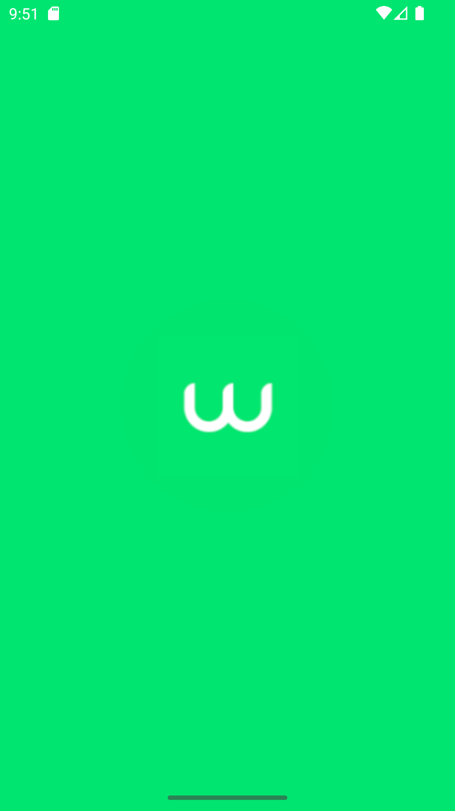
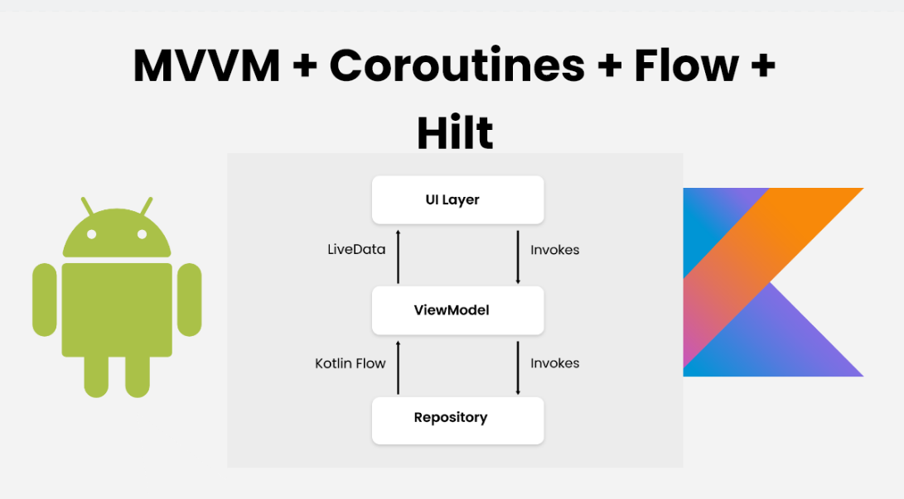

# Desafio Técnico para Desenvolvedor(a) Android


## Objetivo
- Criar uma aplicativo que consuma uma REST API e exiba uma listagem de eventos;
- Cada item da lista deve permitir acesso à detalhes do evento;
- No detalhe do evento é importante exibir:
  - suas informações;
  - opções de check-in;
  - e compartilhamento.


## Requisitos mínimos
- App deve compilar sem a necessidade de nenhum ajuste após ser clonado.
- Suporte à API 19 e funcionar com a API mais recente do Android.
- Código deve ser escrito em Kotlin.


## Links
Links para as seções do projeto:
<p>
  <a href="#preview">Preview</a> •
  <a href="#layouts">Layouts</a> •
  <a href="#download">Download</a> •
  <a href="#features">Features</a> • 
  <a href="#arquitetura">Arquitetura</a> • 
  <a href="#bibliotecas">Bibliotecas</a>
</p>


## Preview


## Layouts
Splash | Eventos
:-------------------------:|:-------------------------:
 | 

Detalhes | Checkin
:-------------------------:|:-------------------------:
 | 


## Download
Para clonar o repositório você precisa:
- copiar o comando abaixo
```shell
git clone https://github.com/viniciusjanner/android_desafio_tecnico_empresa_sicredi.git
```
- abrir o Terminal do seu computador;
- colar o comando;
- teclar enter.

## Features
O aplicativo conta com as seguintes features:
- Tela de splash screen;
- Tela com a listagem de eventos
- Tela de detalhes do evento com as seguintes opções:
  - Informações sobre o evento;
  - Botão para abrir o endereço em aplicativo de mapas.
  - Botão para compartilhar o evento;
  - Botão para exibir a tela de check-in.
- Tela de check-in do evento com as seguintes opções:
  - Campo para inserir nome;
  - Campo para inserir email;
  - Valicação do preenchimento dos campos;
  - Botão para efetuar check-in.


## Arquitetura
O aplicativo foi desenvolvido utilizando a arquitetura **MVVM**.
</br>
</br>
Logo abaixo está em imagem o funcionamento desta arquitetura.
</br>
</br>

</br>
</br>
O projeto é modularizado, separando bem as reponsabilidades e facilitando:
- manutenções futuras;
- implementação de testes;
- escalabilidade.

Os módulos são:
- app: recursos de framework;
- core: recursos para mapear e tratar os dados.

Temos também:
- **Dagger Hilt** para injeção de dependências;
- Gradle com **Kotlin DSL** para gerenciamento das dependências.
- Workflows para CI/CD no **GitHub Actions**.


## Bibliotecas
As seguintes bibliotecas e frameworks foram usadas na construção do projeto:
- [Kotlin](https://kotlinlang.org/)
- [AndroidX](https://developer.android.com/jetpack/androidx)
- [Dagger Hilt](https://dagger.dev/hilt/)
- [Retrofit](https://github.com/square/retrofit)
- [Coroutines](https://developer.android.com/courses/pathways/android-coroutines)
- [Flow](https://developer.android.com/kotlin/flow)
- [Navigation](https://developer.android.com/jetpack/androidx/releases/navigation)
- [Material Design](https://developer.android.com/develop/ui/views/theming/look-and-feel)
- [Facebook Shimmer](https://github.com/facebookarchive/shimmer-android)
- [Glide](https://github.com/bumptech/glide)

  
